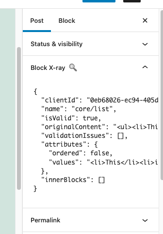

# Block X-ray Attributes

Stable Tag: 1.1.1  
Requires at least: 5.5  
Tested up to: 5.9  
Requires PHP: 7.2  
License: GPL v2 or later  
Tags: block attributes, gutenberg, editor, block, developer, attributes  
Contributors: salcode  

## Description

This plugin adds a section called "Block X-ray" to the Document sidebar in the editor. This "Block X-ray" section displays the attributes for the currently selected block.

## Screenshots

1. The **Block X-ray** section in the document sidebar 

## Frequently Asked Questions

### Where is this plugin developed?

Development of this code happens at [github.com/salcode/block-xray-attributes](https://github.com/salcode/block-xray-attributes)

### Why Don't I See an Update from 1.1.0

When the initial version (`1.1.0`) was uploaded to the WordPress.org plugin repository, the [Update URI plugin header](https://make.wordpress.org/core/2021/06/29/introducing-update-uri-plugin-header-in-wordpress-5-8/) was accidentally included. This plugin header prevents downloading updates from the WordPress.org API.

The `Update URI` header is very useful when your plugin is NOT hosted on the WordPress.org repository. However, now that the plugin is hosted on the WordPress.org repository, the `Update URI` plugin header should not be included.

If you are stuck on version `1.1.0` and want the latest version, you should `Delete` this plugin and reinstall it.

Once you move beyond version `1.1.0`, you should no longer experience this problem.

## Changelog

### Unreleased

* Add `Copy Block Data` button ([#17 Add button to copy data](https://github.com/salcode/block-xray-attributes/issues/17))

### 1.1.1

* Remove "Update URI" from plugin headers

### 1.1.0

* Change "Requires at least" to `5.5`
* Rename `SelectedBlockAttributes` component to `BlockXray`
* Add Higher Order Component `WithSelectedBlock`

### 1.0.0

* Initial release
